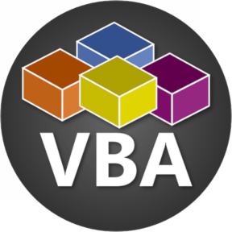

<div align="center">


<h1>VBA Support for VS Code</h1>

[![CI][ci-badge]][ci-status]
[![Marketplace Installs][badge-installs-market]][vs-marketplace]
[![Open VSX Installs][badge-installs-vsx]][open-vsx]

</div>


## ✨ Features
> We power the [syntax highlighting on GitHub][gh-linguist] for VBA and VB6!

- Syntax highlighting for
  - **VBA**
  - **VB6**
- Comprehensive [snippets](#-snippets)
- Support for some niche BASIC dialects _(community maintained)_:
   - WinWrap Basic (WWB)

For technical details about the languages and grammars, see the [docs](docs/grammar_structure.md).


## 💡 Snippets
Available snippets _(all languages)_:
- `If`
- `ElseIf`
- `Else`
- `Sub`
- `Function`


## 📖 Configuration for VB6 projects
By default, `.bas`, `.cls` and `.frm` files open as **VBA**.

To treat them as VB6 instead, add a `.vscode/settings.json` to your project:
```json
{
  "files.associations": {
    "*.bas": "vb6",
    "*.cls": "vb6",
    "*.frm": "vb6"
  }
}
```


## 📌 Project Status
This project is **actively maintained**:
- ✅ All pull requests are welcome and will be reviewed
- ✅ Issues and bugs are adressed
- ⚠️ For now, I won't develop new features by myself

---

For advanced features like a VBA language server, try [SSlinky/VBA-LanguageServer][sslinky-vba-ls].


## 🤝 Contributing
Your help is highly appreciated!

- **Join the conversation:** [GitHub Discussions][discussions]
- **Report Issues or Submit Changes:** see the [Contribution Guidelines](CONTRIBUTING.md)


## 📦 Installation
From VS Code:
1. Launch Quick Open (<kbd>Ctrl</kbd>+<kbd>P</kbd>)
2. Run
   ```
   ext install serkonda7.vscode-vba
   ```

Or install from [Open VSX][open-vsx].


## 📜 License
Source code, grammars and snippets: [Mozilla Public License (MPL-2.0)](LICENSE.txt).

Extension icon: [CC-BY-4.0](images/LICENSE.txt), courtesy of the GitHub Explore authors.


<!-- links -->
[ci-badge]: https://github.com/serkonda7/vscode-vba/actions/workflows/ci.yml/badge.svg
[ci-status]: https://github.com/serkonda7/vscode-vba/actions/workflows/ci.yml

[badge-installs-market]: https://img.shields.io/visual-studio-marketplace/i/serkonda7.vscode-vba?label=Installs
[badge-installs-vsx]: https://img.shields.io/open-vsx/dt/serkonda7/vscode-vba?label=VSX%20downloads
[vs-marketplace]: https://marketplace.visualstudio.com/items?itemName=serkonda7.vscode-vba
[open-vsx]: https://open-vsx.org/extension/serkonda7/vscode-vba

[discussions]: https://github.com/serkonda7/vscode-vba/discussions

[gh-linguist]: https://github.com/github-linguist/linguist/tree/main/vendor

[sslinky-vba-ls]: https://github.com/SSlinky/VBA-LanguageServer
