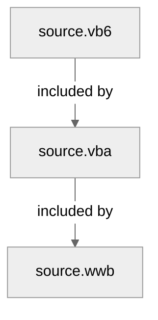

# Grammar Structure
This repo provides grammars for multiple languages in the BASIC family.

The grammars, like the languages themselves, build upon each other:

## Differences between languages
> Without warranty of completeness or correctness

- VB6 vs VBA: see [#74 (comment)][74-comment]
- VBA vs WWB: see [#58 (comment)][58-comment]

<!-- links -->
[74-comment]: https://github.com/serkonda7/vscode-vba/issues/74#issuecomment-1577752559
[58-comment]: https://github.com/serkonda7/vscode-vba/pull/58#issuecomment-1299659990
