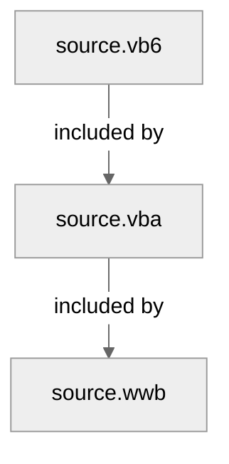

# Grammar Structure
This repo provides grammars for multiple languages in the BASIC family.

The grammars, like the languages themselves, build upon each other:

## File extensions
Beside official ones, the following inofficial file extensions are associated as well:
- VBA
  - `.doccls` (see [#103][103])
  - `.vba` (see [#87][87])

## Differences between languages
> Without warranty of completeness or correctness

- VBA vs VB6
  - [64-bit features of VBA7][vba7-updates]
  - Unique module declarations: see [#74 (comment)][74-comment]
- WWB vs VBA: see [#58 (comment)][58-comment]

<!-- links -->
[vba7-updates]: https://learn.microsoft.com/en-us/office/vba/language/concepts/getting-started/64-bit-visual-basic-for-applications-overview#summary-of-vba7-language-updates
[74-comment]: https://github.com/serkonda7/vscode-vba/issues/74#issuecomment-1577752559
[58-comment]: https://github.com/serkonda7/vscode-vba/pull/58#issuecomment-1299659990
[103]: https://github.com/serkonda7/vscode-vba/issues/103
[87]: https://github.com/serkonda7/vscode-vba/pull/87
